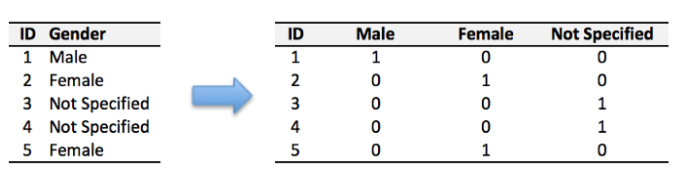

# 資料預處理 ( Data Preprocessing )

## Missing data
> 用於資料有缺失時

* 常見的處理方式有兩種：
    
    1. 丟棄 ( 用在資料量夠多時 )
    
    2. 補值

### 丟棄

> 可以使用 pandas 的 `.dropna([Options])`
* Options：
    
    * 為空：刪掉有空值 ( NAN, null ) 的整個橫排
    
    * how="all"：整橫排都是空值才刪掉
    
    * subset=[\<column name1, name2...>]：column name 直排有空值才刪掉該橫排，其餘不理

### 補值

> 可以使用 pandas 的 `.fillna([Options])`
* Options：

    * num：把空值補一個固定數字
    
    * DataFrame.mean()：補平均值
    
    * DataFrame.mode()[0]：補眾數 ( 出現最多次的數字 )

### 範例

* [Missing_Data.py](./Missing_Data.py)

## One-hot encoding
> 只適合用在資料特徵少的時候，否則會造成維數災難

### 有序資料
> 如衣服大小 XS S M L XL 可以變成 1 2 3 4 5 

* 可以用 mapping 的方式來改值：`DataFrame[\<column name>].map(<dict>)`
    >```=
    > dict = {  
    >   "XS":1,  
    >   "S":2,
    >   "M":3,
    >   "L":4,
    >   "XL":5,
    >   }  
    >```

### 無序資料
> 這裡就需要用到 One-hot encoding 了  
> 由於是無序的資料，因此需要讓資料值總和相同，才不會影響到運算結果  
> 例如性別：
>
>

* 可以用 pandas.get_dummies(DataFrame[\<column name>],[Options])
    * Options：
        * prefix = \<str>：在創出來的欄位加上前綴詞

### 範例

* [One-hot-encoding.py](./One-hot-encoding.py)

## Feature Scaling

## 其他

## 參考資料

* [資料分析-機器學習 2-4 -- Yeh James](https://medium.com/jameslearningnote/%E8%B3%87%E6%96%99%E5%88%86%E6%9E%90-%E6%A9%9F%E5%99%A8%E5%AD%B8%E7%BF%92-%E7%AC%AC2-4%E8%AC%9B-%E8%B3%87%E6%96%99%E5%89%8D%E8%99%95%E7%90%86-missing-data-one-hot-encoding-feature-scaling-3b70a7839b4a)