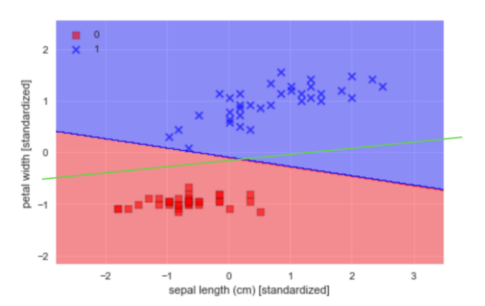
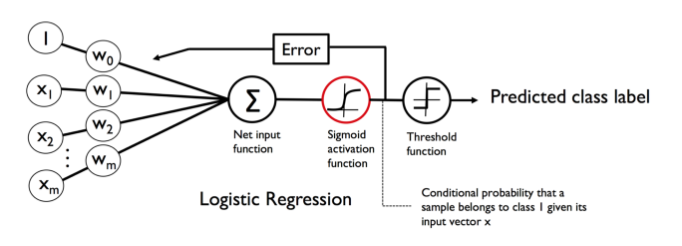
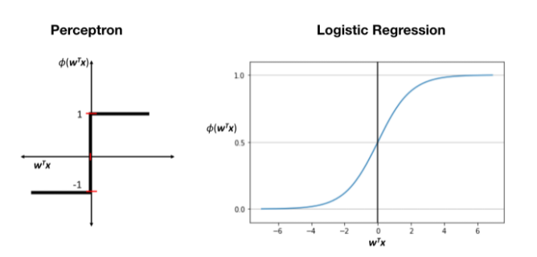

# 邏輯斯回歸 Logistic Regression

## 前置條件

* 邏輯斯回歸是一個 **"分類模型"**，而不是 **"回歸模型"**

* 優點：
    
    * 資料不需要線性可分
    
    * 可以獲得 A 類跟 B 類的機率
    
    * 實務上Logistic Regression執行速度非常快

* 缺點：

    * 線的切法不夠漂亮，以人的觀察要像是綠線才是一個比較好的分法 ( SVM 可解決此問題 )
    
        

* 邏輯斯回歸數學模型
    
    

    > 基本上和 PLA 相差不大，就只是前面多了個 Sigmoid 函數 ( 或稱 logistic function )

* 邏輯斯回歸與 PLA 激勵函數的差別
    
    

    > Sigmoid 函數的 y 介於 0~1 之間
    >
    > 假設 $z=w^Tx$
    >
    > 則 $\phi(z)=\frac{1}{1+e^{-z}}$

* PLA 以 1、-1 分類，邏輯斯回歸以 1、0 分類

## 學習規則

$$
\prod_{i=1}^n\Bigl(\phi(z^{(i)})\Bigr)^{y^{(i)}}\cdot \Bigl(1-\phi(z^{(i)})\Bigr)^{1-y^{(i)}}
$$
> $\Pi$：連乘符號

* 上面的公式的目的是希望當 y=1 時，$\phi(z)$ 越靠近 1 ( 判斷成 1 類的 **機率** 越大 )，反過來說，也就是當 y=1 時，$\phi(z)$ 越遠離 0 ( 判斷成 0 類的 **機率** 越小 )
    >
    > y=1：右項為 1，所以只看左項
    >
    > y=0：左項為 1，所以只看右項

* 找到一組 $w$ 讓上面的公式到達最大值 ( 可利用微積分以及梯度下降，或直接套函式 )
