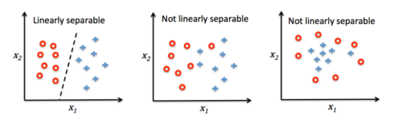

# 感知器 Perceptron, PLA

## 前置條件

* PLA 用於線性分類

* 資料需要可線性分離：

    * 2D：可以用一條線切出兩群
    
    * 3D：可以用一個平面切出兩群

    

* PLA 數學模型

    

    * Inputs ( 輸入資料 )：$x_0$ ~ $x_n$ , $x_0$ 永遠 = 1

    * weights ( 權重 )：$w_0$ ~ $w_n$

    * $\Sigma$：把左邊的部分加起來後丟給右邊

    * Activation function ( 激勵函數 )：輸入 >0 就判斷 1、$\le$ 0 就判斷成是 -1
        > 也可以是其他判斷方法

## 學習規則
 
1. 初始化一個 **"加權為 0"** 或 **"很小"** 的亂數

2. 對每個訓練樣本 ( $x^{(i)}$ ) 進行：
    
    1. 計算輸出值 ( $\hat y$ )
    
    2. 更新加權 ( $w$ )
        
        > **"加權向量 ( $w$ )"** 是由多個 **"加權重量 ( $w_j$ )"** 所組成  
        
        * 更新後的 **"加權重量 ( $w_j$ )"** 定義 ( $:=$ ) 為：  
        $$ 
        w_j:=w_j+\Delta w_j
        $$
        
        * 其中的 $\Delta w_j$ 代表 $w_j$ 的變化量：
        $$
        \Delta w_j = \eta(y^{(i)} - \hat y^{(i)})x^{(i)}_j
        $$
        
        > $\eta$ ：**"學習速率"**： $0 < \eta \le 1$  
        >
        > $y^{(i)}$ ： 第 $i$ 個訓練樣本的 **"真實類別標籤 ( True class label ) "，代表應輸出的結果**
        >
        > $\hat y^{(i)}$ ： 第 $i$ 個訓練樣本的 **"預測類別標籤 ( Predicted class label ) "，代表實際輸出的結果**
        >
        > $x^{(i)}_j$ ： 第 $i$ 個訓練樣本的第 $j$ 個 **"特徵 ( Feature )"**  
        >
        > $y^{(i)} - \hat y^{(i)}$：如果預測正確就會為 0 ( 應輸出的結果與實際輸出的結果相同，$y^{(i)} = \hat y^{(i)}$ )

        * 或寫得簡單一點：
        $$
        w = w +\Delta w\\
        \Delta w = y\cdot x\\
        $$
    
    3. 如果完全預測正確就退出程式

## 參考資料

* [資料分析-機器學習 3-2 -- Yeh James](https://medium.com/jameslearningnote/%E8%B3%87%E6%96%99%E5%88%86%E6%9E%90-%E6%A9%9F%E5%99%A8%E5%AD%B8%E7%BF%92-%E7%AC%AC3-2%E8%AC%9B-%E7%B7%9A%E6%80%A7%E5%88%86%E9%A1%9E-%E6%84%9F%E7%9F%A5%E5%99%A8-perceptron-%E4%BB%8B%E7%B4%B9-84d8b809f866)