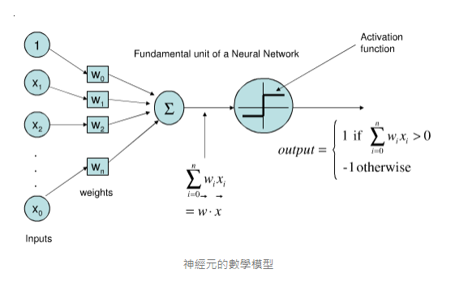

# Ch1. 神經元
> **"感知器 ( Perceptron, PLA )"** 與 **"適應線性神經元 ( Adaptive linear neurons )"** 是最早被開發出來的**機器學習演算法**

* 神經元基本數學模型
    
    

## 演算法

* 感知器 ( Perceptron, PLA )

* 邏輯斯回歸 ( Logistic Regression )

## 數據集

* 鳶尾花數據集 ( Iris Dataset )

## 套件

* pandas

* Numpy

* matplotlib

## README

* [感知器](./Perceptron/README.md)

* [邏輯斯回歸](./Logistic_Regression/README.md)

## 範例

* 感知器：[Perceptron.py](./Perceptron/Perceptron.py)

* 邏輯斯回歸：[Logistic_Regression.py](./Logistic_Regression/Logistic_Regression.py)
